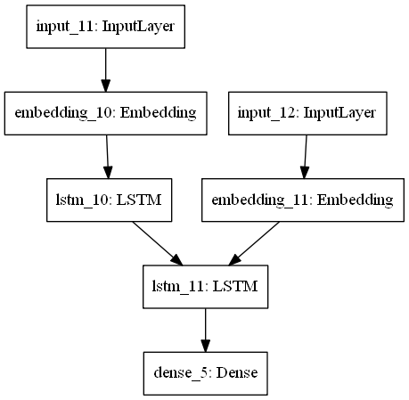

# 한자 문헌 번역기

BOAZ ADV 프로젝트 **한자 문헌 번역기**입니다.

학습 데이터셋으로 국사편찬위원회에서 제공하는 [조선왕조실록](http://sillok.history.go.kr/main/main.do) 전문을 사용합니다.

사용 모델은 LSTM기반의 Sequence to Sequence를 사용하고 있습니다.

> 추후 BERT 등의 모델로 시도해볼 예정

테스트 데이터로는 [승정원일기](http://sjw.history.go.kr/main.do)를 사용합니다.

